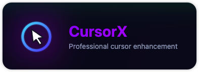

<div align="center">
  
  
  **A modern cross-platform desktop app for cursor highlighting**
  
  [](https://github.com/luckrnx09/CursorX/actions/workflows/ci.yml)
  [](https://github.com/luckrnx09/CursorX/actions/workflows/release.yml)
  [](https://opensource.org/licenses/MIT)
</div>

---

## 🎯 CursorX

CursorX is a powerful yet lightweight desktop application that enhances your screen recordings, presentations, and tutorials by providing real-time cursor highlighting. Built with modern technologies, it runs seamlessly on macOS, Windows, and Linux.

Perfect for:
- 📹 **Content Creators** - Make your tutorials more engaging
- 👨‍🏫 **Educators** - Help students follow along with demonstrations
- 💼 **Presenters** - Keep your audience focused during presentations
- 🎥 **Screen Recorders** - Add professional cursor effects to your videos

---

## 📥 Download

Download the latest installer for your operating system [here](https://github.com/luckrnx09/CursorX/releases).

### One-line install

**macOS / Linux**

```bash
curl -fsSL https://raw.githubusercontent.com/luckrnx09/CursorX/main/scripts/install.sh | bash
```

- macOS: downloads the dmg, installs `CursorX.app` to `/Applications` and removes the Gatekeeper quarantine flag.
- Linux: downloads the AppImage to `~/.local/bin/cursorx` and creates a desktop entry.

**Windows (PowerShell)**

```powershell
irm https://raw.githubusercontent.com/luckrnx09/CursorX/main/scripts/install.ps1 | iex
```

Downloads the NSIS installer and runs it silently.

### Auto-update

- **Windows / Linux AppImage** — updates download in the background via GitHub Releases and apply on restart.
- **macOS** — updates in-app: CursorX downloads the new dmg and swaps the app bundle automatically.

You can also check manually from **Settings → Updates**.

---

## ✨ Features

### 🎨 Customizable Cursor Highlighting
- **Adjustable Size** - Choose the perfect highlight circle size for your needs
- **Custom Colors** - Pick any color for the cursor highlight background and outline
- **Opacity Control** - Fine-tune transparency levels for subtle or bold effects
- **Outline Customization** - Adjust outline width, offset, and appearance

### 🔒 Privacy First
- Runs completely locally on your machine
- No data collection or telemetry
- No internet connection required

---

## 🚀 Development

### Prerequisites

- **Node.js** v20.x or higher
- **npm** v9.x or higher
- **Git**

### Getting Started

1. **Clone the repository**
   ```bash
   git clone https://github.com/luckrnx09/CursorX.git
   cd CursorX
   ```

2. **Install dependencies**
   ```bash
   npm install
   ```

3. **Start development mode**
   ```bash
   npm run dev
   ```
   This will start both the Vite dev server and Electron in development mode.


### Packaging
```bash
npm run package          # Package for current platform
npm run package:mac      # Package for macOS
npm run package:win      # Package for Windows
npm run package:linux    # Package for Linux
npm run package:all      # Package for all platforms
```
---

## 🐛 Known Issues

- macOS Sonoma and later may require additional accessibility permissions
- Some Linux distributions may need additional dependencies for transparency effects

For a complete list of issues and upcoming features, check our [GitHub Issues](https://github.com/luckrnx09/CursorX/issues).

---

## 📄 License

CursorX is open source software licensed under the [MIT License](LICENSE). 

---

## 🌟 Support

If you find CursorX useful, please consider:

- ⭐ **Star this repository** to show your support
- 🐛 **Report bugs** to help us improve
- 💬 **Share feedback** on what features you'd like to see
- 📢 **Spread the word** to others who might find it useful

---
